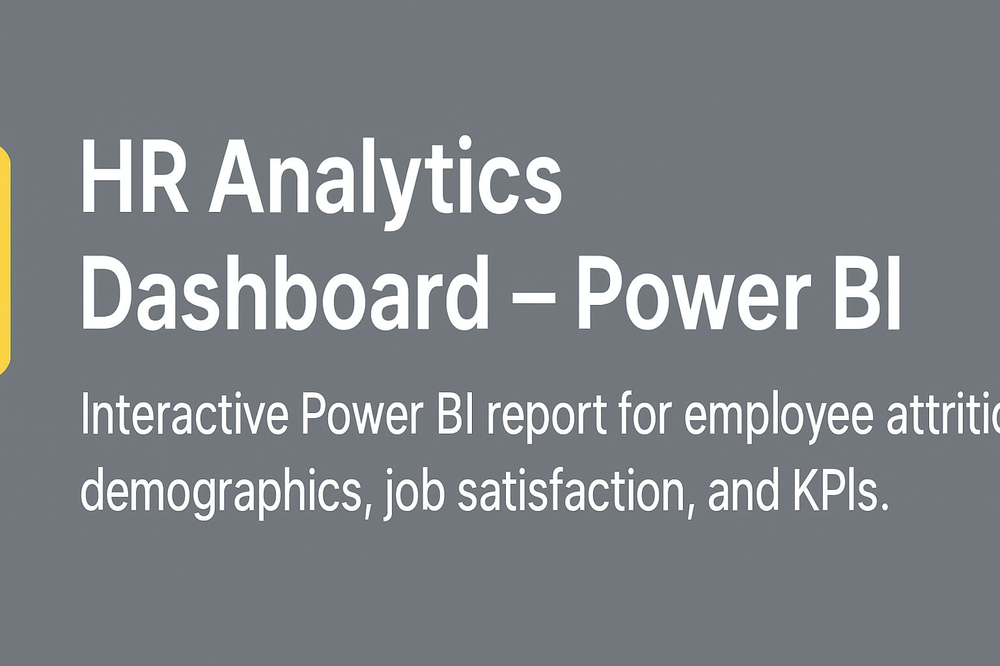

  

# HR Analytics Dashboard — Power BI

An interactive HR Analytics dashboard built using **Power BI** to provide full visibility into workforce composition, promotion readiness, tenure distribution, and employee demographics. This project demonstrates business-focused analytics, KPI design, and insight-driven storytelling for HR decision-making.

---

## 📌 Business Context

HR leadership requires clear, data-backed insights to manage workforce planning, promotions, and employee retention. This dashboard enables stakeholders to quickly understand **who the employees are, how long they stay, who is eligible for promotion, and where potential workforce risks exist**.

The dashboard analyzes **1,470 employees** and presents actionable insights through an executive-ready visual design.

---

## 🎯 Business Objectives

- Monitor overall workforce composition and demographics  
- Identify employees due for promotion  
- Analyze service year (tenure) distribution  
- Understand workforce structure across organizational levels  
- Support HR planning and people management decisions  

---

## SQL Data Extraction 

Initial workforce metrics were validated and extracted using SQL queries from an HR employee database. SQL was used to aggregate key business metrics such as total headcount, gender distribution, promotion eligibility, tenure distribution, and workforce levels. The extracted data was then loaded into Power BI for further modeling, DAX calculations, and visualization.

SQL was primarily used for:
- Workforce summary metrics
- Promotion eligibility analysis
- Service year (tenure) aggregation
- Employee level distribution

---

## ❓ Business-Level Questions Answered (With Insights & Numbers)

1. **What is the total workforce size?**  
   → The organization currently has **1,470 employees**.

2. **What is the gender distribution across the workforce?**  
   → **882 males (60%)** and **588 females (40%)**, indicating a moderate gender imbalance.

3. **How many employees are currently active versus retrenched?**  
   → **1,353 employees (92%)** are actively in service, while **117 employees (8%)** have been retrenched.

4. **How many employees are due for promotion?**  
   → **72 employees (4.9%)** are currently due for promotion, while **1,398 employees (95.1%)** are not yet eligible.

5. **What does the tenure (service year) distribution look like?**  
   → The largest employee groups fall within:
   - **5 years: 196 employees**
   - **1 year: 171 employees**
   - **3 years: 128 employees**
   This indicates a workforce concentrated in early-to-mid tenure stages.

6. **Is the organization more junior or senior-heavy?**  
   → The workforce is heavily concentrated at lower levels:
   - **Level 1: 543 employees**
   - **Level 2: 534 employees**
   Together, Levels 1 and 2 make up over **73% of total employees**, suggesting a predominantly junior workforce.

7. **How is employee proximity (distance status) distributed?**  
   →  
   - **Very close: 940 employees (63.95%)**  
   - **Close: 301 employees (20.48%)**  
   - **Very far: 229 employees (15.58%)**  
   This suggests most employees live close to the workplace, reducing commute-related risk.

8. **Does the workforce show readiness for internal growth and promotions?**  
   → With only **4.9%** of employees currently due for promotion, the organization may need to review promotion timelines or succession planning strategies.

---

## 📊 Key Metrics Tracked

- Total Employees  
- Gender Distribution (%)  
- Active vs Retrenched Employees  
- Employees Due for Promotion  
- Service Year (Tenure) Distribution  
- Workforce Level Distribution  
- Employee Distance Status  

---

## 🔍 Key Insights Summary

- The organization has a **young and junior-heavy workforce**, with most employees at Levels 1 and 2.  
- A **low promotion eligibility rate (4.9%)** may signal potential future retention or motivation risks.  
- The majority of employees are **actively employed (92%)**, indicating workforce stability.  
- Proximity analysis shows **nearly 64% of employees live very close**, which may positively impact attendance and productivity.

---

## 💡 Business Recommendations

- Review promotion policies to ensure high-performing employees are recognized in a timely manner  
- Develop structured career progression plans for junior-level employees  
- Monitor mid-tenure employees closely, as they form the largest segment of the workforce  
- Use distance insights to support hybrid or flexible work decisions  

---

## 🧹 Data Preparation & Modeling

- Cleaned and transformed HR data using **Power Query**  
- Standardized categorical fields such as service year, level, and distance status  
- Created calculated measures for:
  - Promotion eligibility percentage  
  - Workforce distribution metrics  
- Modeled data for efficient filtering and interactive analysis  

---

## 🔍 Analytical Approach
1. **Data Preparation**
   - Cleaned categorical inconsistencies
   - Validated attrition indicators
   - Grouped employees by tenure and department

2. **SQL Analysis**
   - Attrition rates by department and role
   - Tenure-based exit patterns
   - Demographic risk segmentation

3. **Dashboard Design**
   - Attrition KPIs
   - Departmental risk heatmaps
   - Demographic breakdowns

---     

## 🛠 Tools & Technologies

- **Power BI Desktop**  
  - Power Query  
  - DAX measures  
  - Interactive dashboards  
- Excel / CSV data sources  

---

## ▶️ How to Use the Dashboard

1. Download the `HR Power BI report.pbix` file  
2. Open it using **Power BI Desktop**  
3. Navigate through pages using the left-side menu  
4. Use visuals and filters to explore workforce insights  

---

## 📈 What This Analysis Enables
- Proactive retention strategies
- Improved workforce planning
- Data-driven HR policy adjustments
- Targeted employee engagement initiatives

---

## 📂 Repository Structure
- `/SQL_Scripts` – Attrition and workforce queries
- `/PowerBI_Dashboard` – HR analytics dashboard
- `/Dataset` – HR dataset
- `README.md` – Project documentation

---

## 🖼 Dashboard Preview

---

## 🚀 Why This Project Matters

This project demonstrates my ability to:
- Translate HR business problems into analytical questions  
- Build executive-ready dashboards  
- Communicate insights using clear KPIs and visuals  
- Support workforce planning with data-driven recommendations  

This project is part of my **Data Analytics portfolio** and is designed to reflect real-world HR reporting scenarios.

---

## 👤 Author
**Munawer Jabeen**  
Data Analyst | Power BI | SQL  
🔗 LinkedIn: *www.linkedin.com/in/munawer-jabeen-900811380*
📧 Email: *munawerjabeen703@gmail.com*

---
## ⭐ If you find this project insightful, feel free to star the repository!

